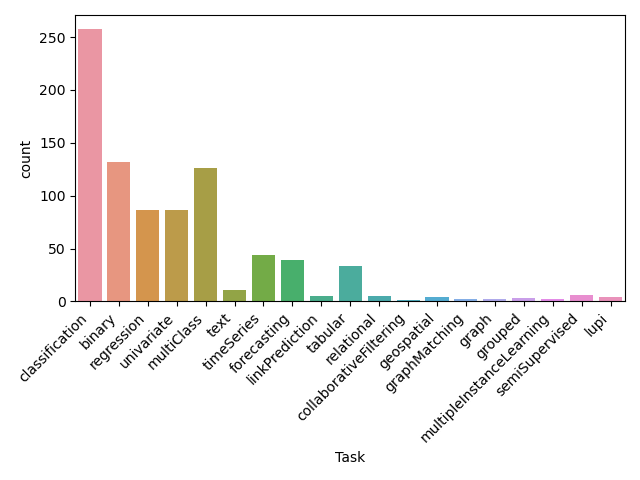
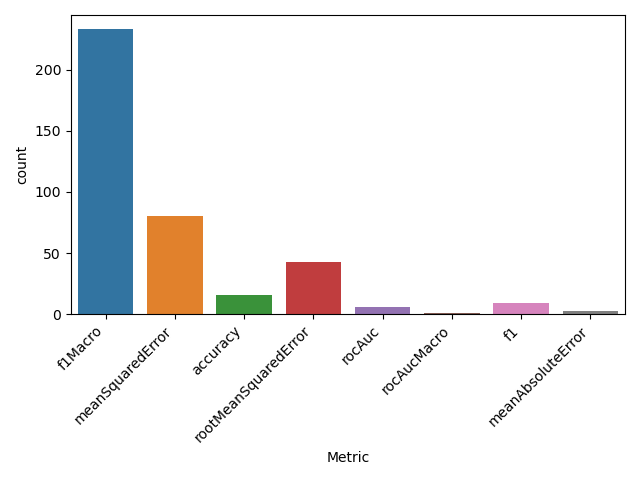

study-d3m
===
I created this repository to gather the scripts and notes I wrote while looking
into the [D3M data repository](https://datasets.datadrivendiscovery.org/d3m/datasets).

Info on the metadata can be found in [DatasetSchema.md](https://gitlab.com/datadrivendiscovery/data-supply/-/blob/shared/documentation/datasetSchema.md).

# Downloading the data
The readme in the repository advises to use [git lfs](https://git-lfs.github.com/), however I had a series of issues with this approach.  

If I try to use the command provided in the readme, I get a permission error:
```
$ git clone --recursive git@datasets.datadrivendiscovery.org:d3m/datasets.git
Cloning into 'datasets'...

git@datasets.datadrivendiscovery.org: Permission denied (publickey).
fatal: Could not read from remote repository.

Please make sure you have the correct access rights
and the repository exists.
```

Trying to clone in read-only mode with `https` runs into a different error: 
```$ git clone --recursive https://datasets.datadrivendiscovery.org/d3m/datasets.git

remote: Enumerating objects: 840547, done.
fatal: the remote end hung up unexpectedly.01 GiB | 6.52 MiB/s   
fatal: early EOF
fatal: index-pack failed
```
The repository is too big, and the git buffer runs out of space as soon as 1GB is reached. 

I am not sure what part of the process this is (indexing? fetching?), the point is that this issue prevents fetching, or any kind of partial operation on the repository, which als means that it is not possible to extract only a subset of the folders at a time.

In the end, I had to use `wget`:
```
$ wget https://datasets.datadrivendiscovery.org/d3m/datasets/-/archive/master/datasets-master.tar.bz2
```
This took a very long time as the DL speed was limited to ~500kb/s. I also made the mistake of downloading the file in `.tar` format, which will come into play later.

At least, I managed to download the full repository in the end, and it is now sitting on the storage unit of drago. 

# Extracting tables of interest
I've extracted all `.csv` files in the repository using the CLI, without filtering anything:
```
tar --wildcards -xvf datasets-master.tar.bz2 '*.csv'
```
This means that the repo includes the `learningData.csv` table for datasets we are not interested in. 
This solution is still better than constantly reading the tar file. I can just filter out all the tables that I am not interested in. 

To filter the tables, I use the `wrangle_metadata.py` script, in which I enter all folders and parse the `datasetDoc.json` file, which contains info about the current dataset (see [here](https://gitlab.com/datadrivendiscovery/data-supply/-/blob/shared/documentation/datasetSchema.md) for more detail). In particular, I am interested in the `resType` field in the json: this field contains the information relative to the datatype of the dataset, which can be any of:
`["image","video","audio","speech","text","graph","edgeList","table","timeseries","raw"]`.
I only care about `table` data, so I have the `tabular_only` flag, which is always `True`, until a non-`table` resource is found. Only datasets for which the `tabular_only` flag is `True` are considered as "valid" for the following operations. 

I use `glob` to parse all dataset names, then I print some statistics and save the viable datasets in the file `viable_datasets.txt`. 
The stats are:
```
tabular_only    394
image            10
video             2
audio             2
speech            0
text              4
graph            26
edgeList          4
table           507
timeseries       34
raw               1
dtype: int64
Dataset with the largest number of tables: 8
Number of viable dataset: 391
```
This means that there are ~400 datasets that are "tabular only", and a large fraction that contain mixed data (this is also reported in the readme of the repository).

# Studying metadata
Now that we have a list of "viable datasets", I use the `study_valid_datasets.py` script to look in more detail into these "viable datasets", in order to extract some additional statistics. Specifically, I am looking for the number of rows/ columns in each datataset, as well as the distribution of tasks and metrics used in the problems associated with these datasets. 

Note that datasets can contain multiple tables in their `resources`, so the "size" of a dataset is given by the sum of the shapes of all tables involved. 

The statistics are reported in the following pictures. 






# Querying Auctus
The script that I am using to query Auctus is `query_auctus.py`. I used the notebook
`python-api-ny-taxi-demand.ipynb` as example for how to use the API to query the
datasets. 

Originally, I was querying all the datasets that I had filtered in `viable_datasets.txt`, 
however there are a lot of them (~400), and querying the API takes a fairly long time. 
Therefore, I modified the `study_valid_datsets.py` to extract only one 
dataset (randomly selected) for each evaluation metric. Still, this failed again
because some datasets are way too big (100k rows, 100s of columns) and that meant
that querying the API took too long. 

Then, I sorted the datasets in each group by their size (n_col*n_rows) and selected
the dataset that had the median number of rows, and I queried Auctus for that. 

I did not notice that `cursor.get_next_page` had a `limit` parameter (default=20), so I added a variable for that. 

I still need to look into the metadata and download the datasets, however at this
point the bases for the benchmark are "ready".  

The format of the query results is reported [here](https://datadrivendiscovery.gitlab.io/datamart-api/query_result_schema.html#query-result-schema).


- Querying Auctus for candidates for each of the datasets in the `valid datasets` set.
- More statistics? 